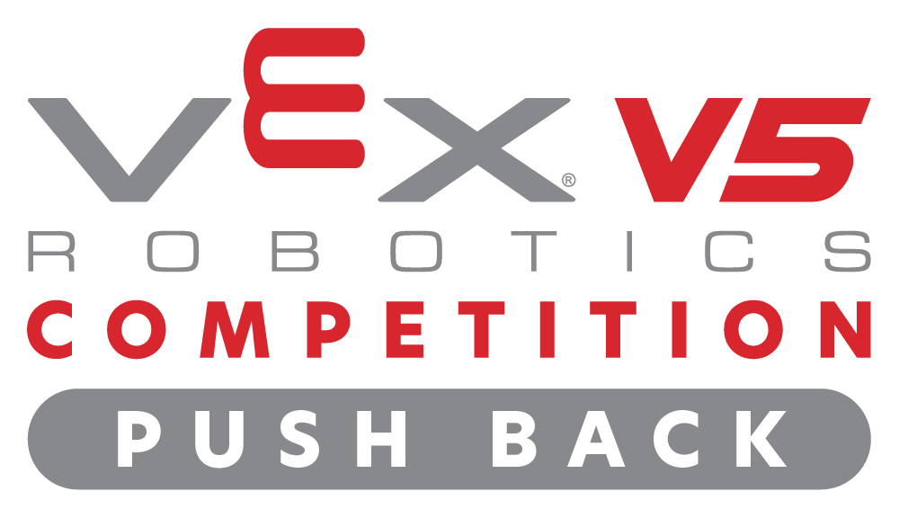

	

---

# V5RC 2025-2026 — Push Back

This repository contains the robot code for the V5 Robotics Competition (2025-2026) "Push Back" season.

## Quick Info
- **Team:** _83123A_
- **Robot Name:** _Mismatch_
- **Season / Game:** V5RC 2025-2026 — Push Back

## Robot Overview
Mismatch is a ruigan style front-loading intake with a fast outake for scoring in the long goal. The chassis is mainly optimized for quick turning and driver control.

## Key Specifications
- Dimensions (L×W×H): _18" × 18" × 18"_
- Drive type: _6-motor tank drive_
- Battery: _V5 11.1V_

## Subsystems
Fill in details for each subsystem below.

 - **Chassis / Drive**
 	- Components: 6-motor tank drive (see `src/globals.cpp` for motor ports)
 	- Gear ratio: 60:36 driven by 600 RPM V5 motors → drivetrain effective ~450 RPM
 	- Wheel size: 3.25" diameter

 - **Intake**
 	- Components: 1 motor (200 rpm), 1 optical/color sensor for matchload sensing
 	- Notes: Sensor is used to detect matchloads and stop intake when a game object is secured; tune sensor placement and debounce timing as needed.

 - **Outake / Shooter**
 	- Components: 1 motor (200 rpm) and 1 optical/color sensor for color-based sorting
 	- Notes: Optical sensor is used to sort by color; outake will eject opposing team colored game objects and run normally for correctly colored ones.

 - **Pneumatics**
 	- Components: Wing piston (ThreeWirePort.H), Scraper piston (ThreeWirePort.G)
 	- Notes: `Wing` is used to gain center control on the long goals; `Scraper` is used to assist matchloading by clearing or guiding game objects. Both pistons are toggled from the controller.

## Sensors
- Optical: two optical sensors used — one for intake/matchload detection and one for color sorting during outake
- No other sensors are used on this robot.

## Controls (Driver Layout)
Describe controller button mappings. Example:

- `R1`: Intake forward
- `R2`: Intake reverse
- `L2`: Outake forward
- `Y`: Toggle wing piston
- `B`: Toggle scraper piston

## Autonomous Routines
- `1` — Left LG Only: _Not Completed_
- `2` — Right LG Only: _Not Completed_
- `3` — Left LG+ML: _Not Completed_
- `4` — Right LG+ML: _Not Completed_
- `5` — Left TMG+LG+ML: _Not Completed_
- `6` — Right BMG+LG+ML: _Not Completed_

## Wiring & Layout
- Drive motors:
	- `L1` — PORT7 (left)
	- `L2` — PORT20 (left)
	- `L3` — PORT18 (left)
	- `R1` — PORT4 (right)
	- `R2` — PORT11 (right)
	- `R3` — PORT14 (right)

- Intake / Outake:
	- `Intake` motor — PORT13 (single motor intake)
	- `Outake` motor — PORT10 (single motor outake, motor reversed in software)

- Pneumatics (three-wire ports):
	- `WingPiston` — Brain.ThreeWirePort.H (used for center control on long goals)
	- `ScraperPiston` — Brain.ThreeWirePort.G (used for matchloading scraper)

- Sensors:
	- `OpticalSensor` — PORT9 (used for color sorting / outake decisions)
	- `AutonOpticalSensor` — PORT19 (used in autonomous routines for color detection)

Notes:
- `Outake` motor is instantiated with reversed polarity in software — check `src/globals.cpp` if you need to flip wiring instead.
- Update port numbers here if the wiring changes on the robot.

## Contributing
- Add issues for bugs and feature requests.
- If you modify the codebase, briefly update this README with relevant notes.

## Credits
- Builders: Pranav Pun, Raheesh Lakhani, Sheikh Ajmaeen Ahmed
- Coder: Sheikh Ajmaeen Ahmed
- Notebooker: Pranav Pun
- Driver: Sheikh Ajmaeen Ahmed